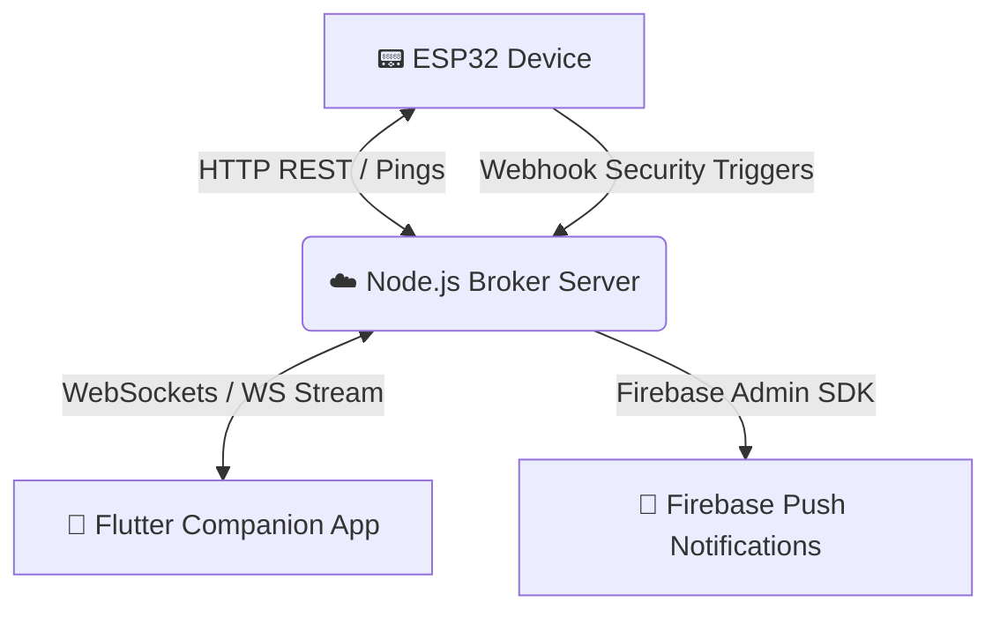

# GEM (Gem Buddy) — Smart Desktop Companion (v1.7)

GEM is an interactive, ESP32-based smart desktop companion featuring hardware sensors, a custom OLED animation system (day/evening/night face modes), scheduled alarms, and a secure **Desk Guard Mode**. 

This repository contains the complete three-tier architecture:
1.  **📟 ESP32 Firmware** (`GemBuddy/`): Written in Arduino/C++, driving the OLED display, light sensor (LDR), capacitive touch pins, buzzer, and OTA updater.
2.  **📱 Flutter Companion App** (`gem_buddy_app/`): Cross-platform dashboard to manage alarms, LDR telemetry, lamp controls, OTA updates, and security logs.
3.  **☁️ Cloud Webhook Broker** (`gem_server/`): Node.js/Express server that acts as a real-time bridge via WebSockets and sends Push Notifications (FCM) to the mobile app.

---

## 🏗️ System Architecture



---

## 🌟 Key Features in v1.7

*   **Desk Guard Mode:** Activating Guard Mode turns GEM into a desktop security monitor. Sensor anomalies (shadows, light flashes, body touches) trigger webhook alerts. 
*   **Remote Guard Sync (Any Network):** Allows toggling Guard Mode from outside the home network. If the app cannot reach the local ESP32 IP address, it updates the cloud broker. The device periodically reads the broker's ping responses and syncs its local configuration.
*   **FCM Push Notifications:** Standardized system-tray notifications delivered to your phone drawer (even when the app is completely closed) using Firebase Cloud Messaging.
*   **Real-time LDR Dashboard:** Calibrated direct light level reading where `0%` is dark and `100%` is bright.
*   **One-Click OTA Updates:** Build and package the latest `firmware.bin` inside the Flutter app assets, allowing wireless flashing directly from the app Settings page.

---

## 🛠️ Folder Breakdown & Setup

### 1. Cloud Webhook Broker (`gem_server/`)
The broker coordinates connectivity and logs, filtering alert spam when disarmed.
*   **Install Dependencies:** Run `npm install` inside the `gem_server` directory.
*   **Start Local Server:** Run `npm start` (defaults to port `3000`).
*   **Secure Push Notifications Configuration (Render Deployment):**
    *   **Option A (Recommended):** In your Render Dashboard, go to **Environment** -> **Secret Files**, create a secret file named `service-account.json`, and paste the Firebase service account JSON credentials inside.
    *   **Option B:** Add an environment variable named `FIREBASE_SERVICE_ACCOUNT` containing the stringified JSON key.

### 2. Flutter Companion App (`gem_buddy_app/`)
*   **Prerequisites:** 
    1. Register your Android app on the Firebase Console using package name: `com.shovin.gem.gem`.
    2. Place your downloaded `google-services.json` inside `gem_buddy_app/android/app/`.
*   **Build the App:**
    ```bash
    flutter pub get
    flutter build apk --release
    ```
    *The output APK will be generated at `build/app/outputs/flutter-apk/app-release.apk`.*

### 3. ESP32 Firmware (`GemBuddy/`)
*   **Compile Settings:** Open `GemBuddy/GemBuddy.ino` using the Arduino IDE.
*   **Target Board:** ESP32 Dev Module (or NodeMCU-32S).
*   **Customization:** Set WiFi fallbacks and broker links in `GemBuddyConfig.h`.
*   **Compilation Output:** Ensure compilation is exported to binary (`GemBuddy.ino.bin`) and placed in `gem_buddy_app/assets/firmware.bin` for OTA bundling.

---

## 🚦 Incident List Legend
The Incident Timeline logs are formatted as follows:
*   **🚨 Intruder Shadow Detected:** Light levels suddenly drop below the ambient average.
*   **🚨 Sudden Flash / Light Spike:** Sudden unexpected bright light directed at the device.
*   **🚨 Physical Touch Intercept:** Body touched or moved.
*   **🛡️ Guard Mode Active/Inactive:** Tracks who activated/deactivated the system (logs whether toggled by `GEM` or the `app`).
